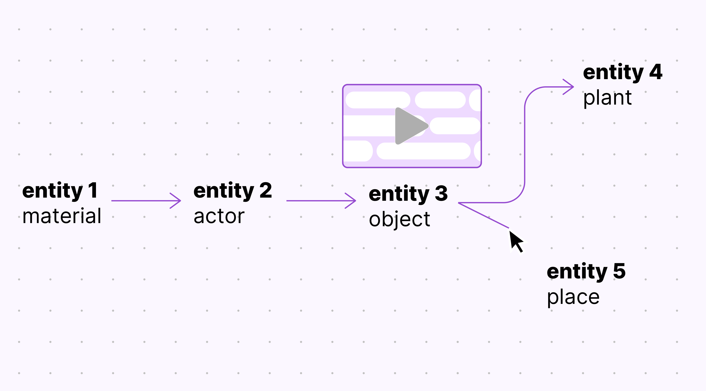

# Xingu Entangled

Dive into the entangled lifeworld of Indigenous communities from the Amazon! “Xingu Entangled” offers an interactive experience with Indigenous material practices from the Upper Xingu region, where artifacts, stories, places, plants, animals, rituals, myths and events are uniquely interconnected. Rather than learning only about physical objects, we are allowed to experience their complexity with the support of video clips and interactive networks. The visualized relations carry deeply intertwined meanings.          

Xingu Entangled is a result of the “Amazonia Future Lab” project, funded by the German Federal Cultural Foundation and the Humboldt Forum Foundation, in partnership with the Prussian Cultural Heritage Foundation, the National Museum UFRJ (Brazil), the Botanic Garden Berlin, the UCLAB of University of Applied Sciences Potsdam, and representatives from the Indigenous community of Ipatse at the Upper Xingu. The aim is to showcase how academic research, design, and Indigenous traditions can converge to inspire decolonial approaches to museum collections.

## How to use
The videos show scenes from the Xingú while the visualisation displays elements that appear in the current scene and their interconnections in a flowchart. As the scenes unfold, so do their associated flowcharts by uncovering and highlighting elements. Interactivity allows users to break out of the default linear narrative and navigate between scenes as well as to learn more about specific elements and their wider contexts.

**Overview**

**Story view**

**Detail view**

## Project team
Fidel Thomet, Nadia Zeissig, Marian Dörk, Andrea Scholz, Thiago da Costa Oliveira, Flavia Heins

## Image Credits
**Collecting and processing for Gimi**
Gimi 1–3: © Staatliche Museen zu Berlin, Ethnologisches Museum /CC BY-SA 4.0
