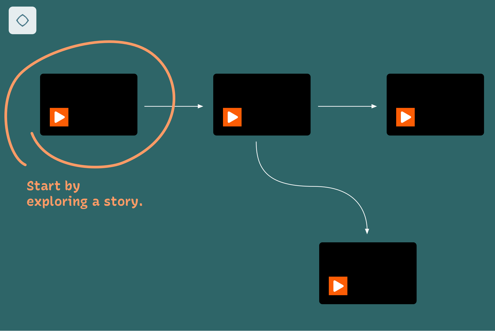

# Xingu Entangled

Dive into the entangled lifeworld of Indigenous communities from the Amazon! “Xingu Entangled” offers an interactive experience with Indigenous material practices from the Upper Xingu region, where artifacts, stories, places, plants, animals, rituals, myths and events are uniquely interconnected. Rather than learning only about physical objects, we are allowed to experience their complexity with the support of video clips and interactive networks. The visualized relations carry deeply intertwined meanings.          

## How to use  
The videos show scenes from the Xingu while the visualisation displays elements that appear in the current scene and their interconnections in a flowchart. As the scenes unfold, so do their associated flowcharts by uncovering and highlighting elements. Interactivity allows users to break out of the default linear narrative and navigate between scenes as well as to learn more about specific elements and their wider contexts.

Overview  
  
Story view  
  
Detail view  
  

## Credits
**Project team**  
Fidel Thomet, Nadia Zeissig, Marian Dörk, Andrea Scholz, Thiago da Costa Oliveira, Flavia Heins

**Partner**  
Indigenous community of Ipatse at the Upper Xingu  
UCLAB at University of Applied Sciences Potsdam   
Ethnologisches Museum (Ethnological Museum)  
National Museum UFRJ Brazil  
Botanic Garden and Botanical Museum Berlin (BGBM)   
Ibero-American Institute (IAI)  
Institut für Museumsforschung (Institute for Museum Research)  

**Images**  
Collecting and processing for Gimi  
Gimi 1–3: © Staatliche Museen zu Berlin, Ethnologisches Museum /CC BY-SA 4.0  
