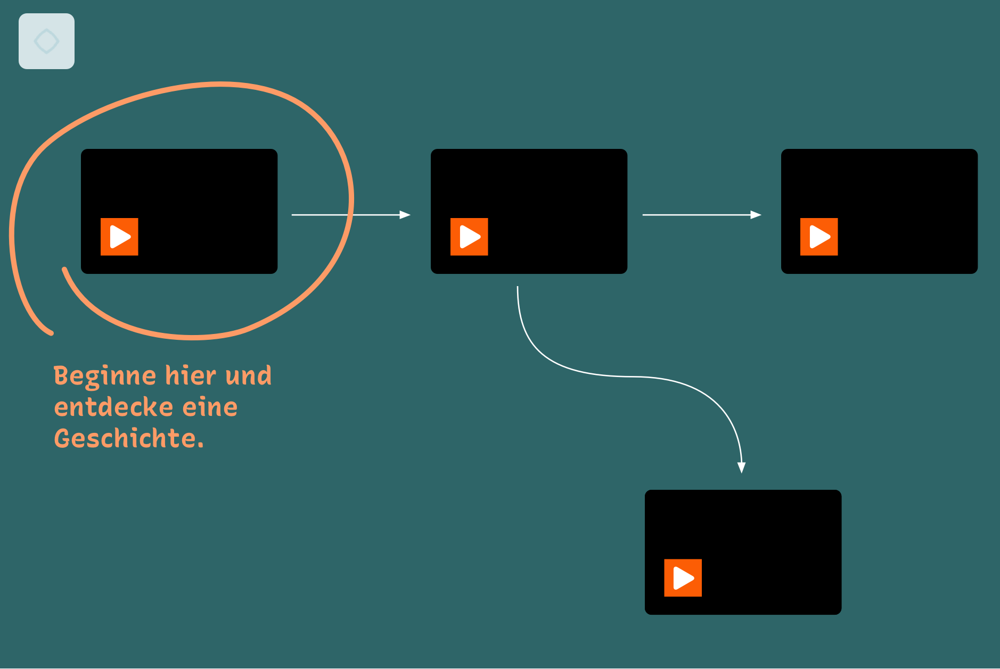
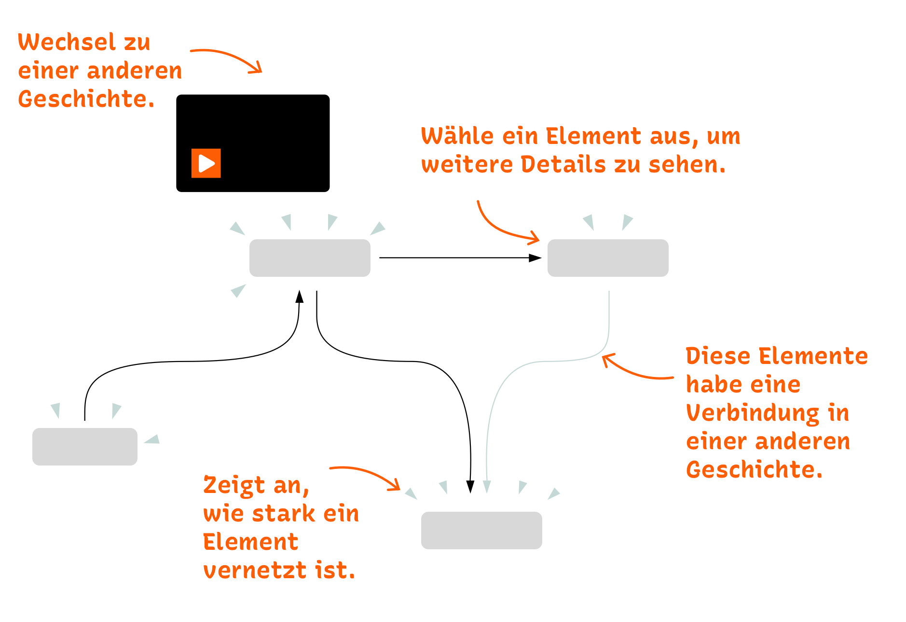
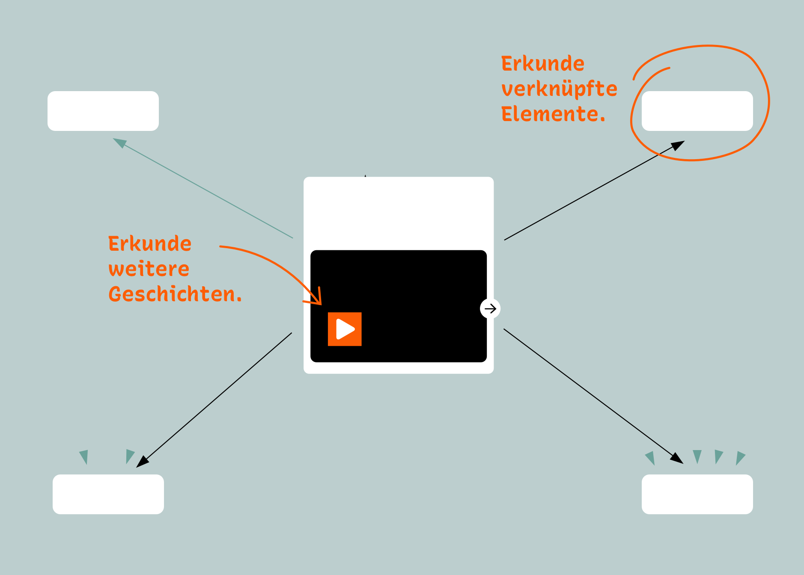

# Xingu Entangled

Tauchen Sie ein in die vielschichtige Lebenswelt der indigenen Gemeinschaften des Amazonas! Xingu Entangled bietet eine interaktive Erfahrung materieller Praktiken von Indigenen Personen aus der Region des Oberen Xingu, wo Artefakte, Geschichten, Orte, Pflanzen, Tiere, Rituale, Mythen und Ereignisse auf einzigartige Weise miteinander verknüpft sind. Statt einfach nur physische Objekte zu beschreiben, erfahren wir ihre Komplexität mithilfe interaktive Netzwerke und Videoclips. Die visualisierten Beziehungen vermitteln tief verwobene Bedeutungen. In der bewussten Überschreitung disziplinärer Grenzen treten indigene Perspektiven in den Vordergrund.

## Wie funktioniert es? 
Die Videos zeigen Szenen der Xingu, während die Visualisierung die in der aktuellen Szene vorkommenden Elemente und ihre Verbindungen in einem Diagramm darstellt. Interagiere mit den Elementen, um aus der Erzählung auszubrechen und zwischen den Geschichten zu navigieren, sowie mehr über bestimmte Elemente und ihre weiteren Zusammenhänge zu erfahren.  

  
Die **Übersicht** zeigt alle verfügbaren Geschichten. Die Pfeile geben eine mögliche Reihenfolge vor. Kehre zur Übersicht zurück, durch das Auswählen des Haussymbol ⌂ in der oberen linken Ecke.  
  
Die **Story**-Ansicht zeigt die Elemente der Szene und ihre Verbindungen.    
  
Die **Detailansicht** zeigt alle Verbindungen der ausgewählten Entität, über alle Geschichten hinweg.  

## Team  
Fidel Thomet, Nadia Zeissig, Marian Dörk, Andrea Scholz, Thiago da Costa Oliveira, Flavia Heins  

## Projekt
Xingu Entangled wurde vom [Amazonia Future Lab](https://amazoniafuturelab.fh-potsdam.de) entwickelt, einem transdisziplinären Forschungsprojekt, das 2021-2024 vom Programm Digitale Kultur der Kulturstiftung des Bundes und der Stiftung Humboldt Forum im Berliner Schloss gefördert wurde. Die Anwendung wurde mit dem Wanderer realisiert, einem webbasierten Tool, das Videomaterial mit Diagrammen verbindet. Der Wanderer ist als [Open Source Software auf GitHub](https://github.com/uclab-potsdam/wanderer) frei verfügbar.    

## Partner  
Indigene Gemeinschaft in Ipatse  
[UCLAB at FH Potsdam](https://uclab.fh-potsdam.de/)   
[Ethnologisches Museum](https://www.smb.museum/en/museums-institutions/ethnologisches-museum/home/)  
[National Museum UFRJ Brazil](https://www.museunacional.ufrj.br/)  
[Botanic Garden and Botanical Museum Berlin](https://www.bo.berlin/en)  
[Ibero-American Institute](https://www.iai.spk-berlin.de/en/home.html)  
[Institut für Museumsforschung](https://www.smb.museum/museen-einrichtungen/institut-fuer-museumsforschung/home/)  

## Simple Language
Xingu Entangled wurde vom [Amazonia Future Lab](https://amazoniafuturelab.fh-potsdam.de) entwickelt, einem Forschungsprojekt, das von 2021 bis 2024 durchgeführt wird. Das Forschungsprojekt wurde durch das Programm Digitale Kultur der Kulturstiftung des Bundes und die Stiftung Humboldt Forum im Berliner Schloss gefördert. Die Anwendung wurde mit dem Wanderer erstellt. Dies ist ein webbasiertes Tool, das Videos mit Diagrammen verbindet. Der Wanderer kann kostenlos genutzt werden und ist als [Open-Source-Software auf GitHub](https://github.com/uclab-potsdam/wanderer) verfügbar.

## Barrierefreiheit
- [Barrierefreiheit](https://www.preussischer-kulturbesitz.de/service/barrierefreiheit.html)
- [Barriere melden](https://www.preussischer-kulturbesitz.de/service/barriere-melden.html)

## Bildnachweise 
Sammeln und verarbeiten für Gimi  
- Gimi 1–3: © Staatliche Museen zu Berlin, Ethnologisches Museum, [CC BY-SA 4.0](https://creativecommons.org/licenses/by-nc/4.0/)  

Die Verbreitung und Bestäubung von Moriche  
- Moriche Palme: © Bryan Ramdeen, [CC BY-SA 4.0](https://creativecommons.org/licenses/by-nc/4.0/)  

Sammeln und verarbeiten für Gimi  
- Gimi: © Staatliche Museen zu Berlin, Ethnologisches Museum, [CC BY-SA 4.0](https://creativecommons.org/licenses/by-nc/4.0/)  

Gimi und dessen Herstellung  
- Hugeku: © Staatliche Museen zu Berlin, Ethnologisches Museum, [CC BY-SA 4.0](https://creativecommons.org/licenses/by-nc/4.0/)
- Kahokuhugu: © Staatliche Museen zu Berlin, Ethnologisches Museum, Helene Tello, [CC BY-SA 4.0](https://creativecommons.org/licenses/by-nc/4.0/)

Annatto und Kurkuma ernten  
- Annatto Pflanze: © J.M.Garg, [CC BY-SA 4.0](https://creativecommons.org/licenses/by-nc/4.0/)  
- Annatto Samen: © Leonardo Aguiar, [CC BY 2.0](https://creativecommons.org/licenses/by/2.0/)  
- Annatto, freigestellte Bilder: © Roger Culos, [CC BY-SA 3.0](https://creativecommons.org/licenses/by-sa/3.0/deed.en)  

Moriche-Blätter sammeln  
- Moriche Speerblätter (u.r.): © Martha Lucia Ortiz-Moreno, [CC BY-SA 4.0](https://creativecommons.org/licenses/by-nc/4.0/)  

Verwendung von Moriche und Matten  
- Hängematte: © Staatliche Museen zu Berlin, Ethnologisches Museum, [CC BY-SA 4.0](https://creativecommons.org/licenses/by-nc/4.0/)  

Verwendung von Utu  
- Pacu: © Dick Culbert, [CC BY 2.0](https://creativecommons.org/licenses/by/2.0/)  

Uhi's Geschichte  
- Moriche Baum: © dc-murayari, [CC BY-SA 4.0](https://creativecommons.org/licenses/by-nc/4.0/)  

Verwendung von Kusu  
- Crenicichla: © Cláudio D. Timm, [CC BY 2.0](https://creativecommons.org/licenses/by/2.0/)  
