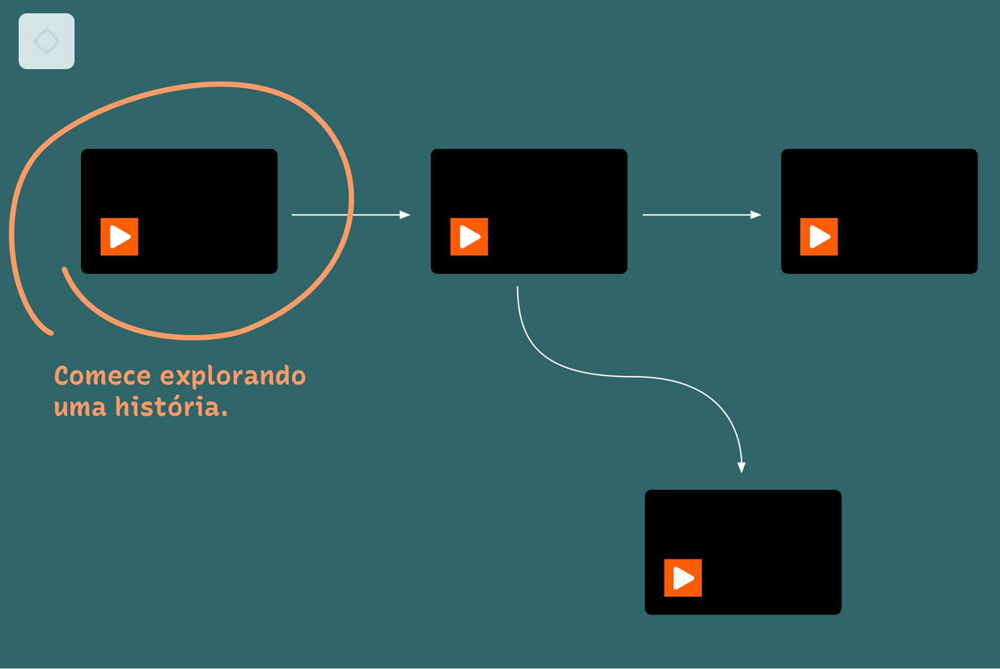
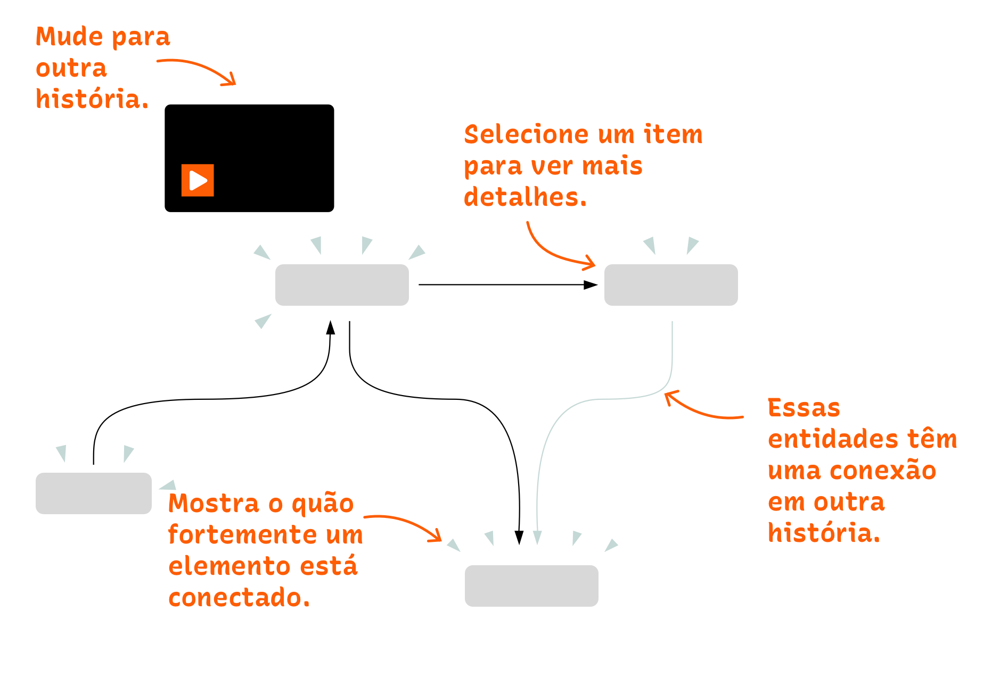
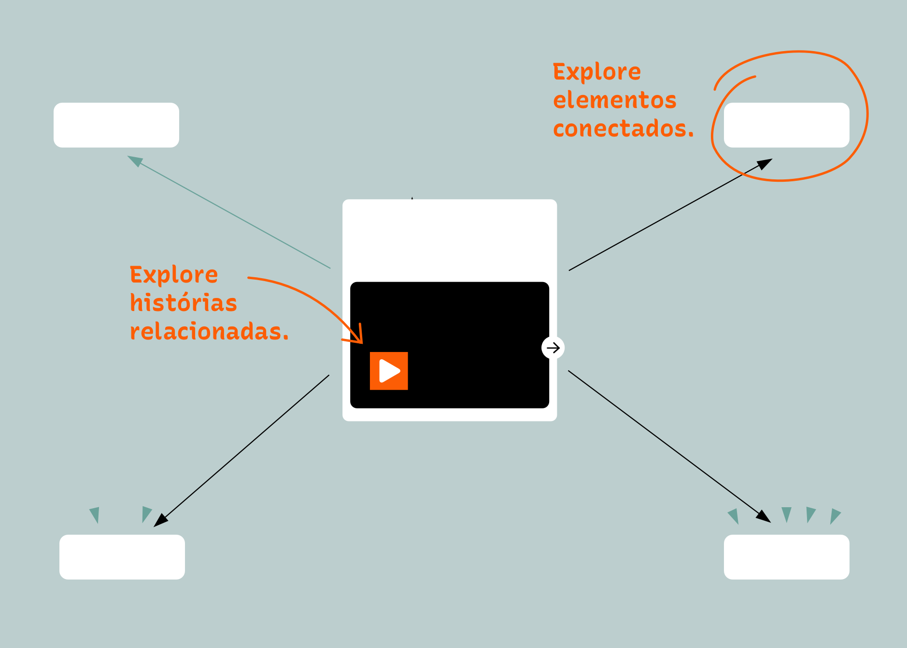

# Xingu Entangled

Mergulhe no mundo entrelaçado das comunidades Indígenas da Amazônia! Xingu Entangled (Xingu Emaranhado) oferece uma experiência multifacetada das práticas materiais Indígenas da região do Alto Xingu, onde artefatos, histórias, lugares, plantas, animais, rituais, mitos e eventos estão única e profundamente conectados. Em vez de aprender apenas sobre objetos físicos, aprecie sua complexidade com o suporte de vídeos e redes interativas. As relações visualizadas carregam significados profundamente entrelaçados.  

## Como navegar 
Os vídeos mostram cenas do Alto Xingu, enquanto os gráficos exibem elementos que aparecem em cena e suas interconexões. À medida que as cenas se desenrolam, seus respectivos diagramas vão evoluindo, revelando os mais diversos componentes. A interatividade permite que você vá além de uma narrativa linear padrão e navegue entre cenas, aprendendo mais sobre entidades específicas e seus contextos mais amplos.  

  
O modo de visualização **Geral** contém todas as histórias disponíveis. As setas sugerem caminhos possíveis de visualização. Você pode retornar à visão Geral selecionando o ícone da casa ⌂ no canto superior esquerdo.  

  
O modo de visualização **História** mostra as entidades conectadas na cena atual.    

  
O modo de visualização **Detalhe** mostra todas as conexões da entidade selecionada em todas as histórias.   

## Equipe  
Fidel Thomet, Nadia Zeissig, Marian Dörk, Andrea Scholz, Thiago da Costa Oliveira, Flavia Heins  

## Projeto  
Xingu Emaranhado é fruto do [Amazonia Future Lab](https://amazoniafuturelab.fh-potsdam.de), um projeto de pesquisa transdisciplinar realizado entre 2021 e 2024, financiado pelo Programa de Cultura Digital da Fundação Cultural Federal Alemã e pela Fundação Humboldt Forum. As visualizações foram desenvolvidas com o Wanderer, uma interface web que vincula gravações de vídeo a redes de dados. O Wanderer está disponível gratuitamente como [software de código aberto no GitHub](https://github.com/uclab-potsdam/wanderer).

## Parceiros  
Comunidade Indígena da Aldeia Ipatse
[UCLAB da Universidade Técnica de Potsdam](https://uclab.fh-potsdam.de/)   
[Ethnologisches Museum Berlim](https://www.smb.museum/en/museums-institutions/ethnologisches-museum/home/)  
[Museu Nacional UFRJ Brasil](https://www.museunacional.ufrj.br/)  
[Botanic Garden and Botanical Museum Berlin](https://www.bo.berlin/en)  
[Instituto Ibero-Americano Berlim](https://www.iai.spk-berlin.de/en/home.html)  
[Institut für Museumsforschung Berlim](https://www.smb.museum/museen-einrichtungen/institut-fuer-museumsforschung/home/)  

## Linguagem simples
Xingu Emaranhado é parte do projeto [Amazonia Future Lab](https://amazoniafuturelab.fh-potsdam.de), realizado entre 2021 e 2024. Este projeto foi apoiado pelo Programa de Cultura Digital da Alemanha e pela Fundação Humboldt Forum. As visualizações foram feitas com o Wanderer, uma ferramenta online que conecta vídeos a redes de dados. O Wanderer é gratuito e pode ser baixado como [software de código aberto no GitHub](https://github.com/uclab-potsdam/wanderer).

## Acessibilidade
- [Report Barrier](https://www.preussischer-kulturbesitz.de/en/services/report-barrier.html)
- [Declaration on Accessibility](https://www.preussischer-kulturbesitz.de/en/services/accessibility.html)

## Créditos das fotos 
Sobre Gimi e como fazer  
- Gimi 1–3: © Staatliche Museen zu Berlin, Ethnologisches Museum, [CC BY-SA 4.0](https://creativecommons.org/licenses/by-nc/4.0/)
- Hugeku: © Staatliche Museen zu Berlin, Ethnologisches Museum, [CC BY-SA 4.0](https://creativecommons.org/licenses/by-nc/4.0/)
- Kahokuhugu: © Staatliche Museen zu Berlin, Ethnologisches Museum, Helene Tello, [CC BY-SA 4.0](https://creativecommons.org/licenses/by-nc/4.0/)   

A distribuição e polinização do Moriche  
- Moriche palma: © Bryan Ramdeen, [CC BY-SA 4.0](https://creativecommons.org/licenses/by-nc/4.0/)  

Coleta e processamento para Gimi  
- Gimi: © Staatliche Museen zu Berlin, Ethnologisches Museum, [CC BY-SA 4.0](https://creativecommons.org/licenses/by-nc/4.0/)  

colheita de urucum e açafrão  
- urucum planta: © J.M.Garg, [CC BY-SA 4.0](https://creativecommons.org/licenses/by-nc/4.0/)  
- urucum sementes: © Leonardo Aguiar, [CC BY 2.0](https://creativecommons.org/licenses/by/2.0/)  
- urucum, imagens isoladas: © Roger Culos, [CC BY-SA 3.0](https://creativecommons.org/licenses/by-sa/3.0/deed.en)  

Coletando folhas de Moriche  
- Moriche folhas de moriche: © Martha Lucia Ortiz-Moreno, [CC BY-SA 4.0](https://creativecommons.org/licenses/by-nc/4.0/)  

Uso de moriche e esteiras
- rede: © Staatliche Museen zu Berlin, Ethnologisches Museum, [CC BY-SA 4.0](https://creativecommons.org/licenses/by-nc/4.0/)  

O uso de Utu  
- Pacu: © Dick Culbert, [CC BY 2.0](https://creativecommons.org/licenses/by/2.0/)  

A história de Uhi  
- Moriche: © dc-murayari, [CC BY-SA 4.0](https://creativecommons.org/licenses/by-nc/4.0/)  

O uso de Kusu  
- Crenicichla: © Cláudio D. Timm, [CC BY 2.0](https://creativecommons.org/licenses/by/2.0/)  
